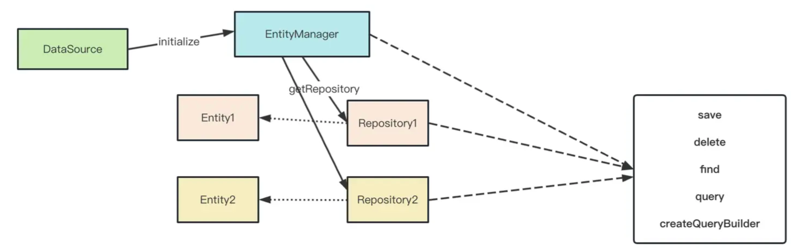

## ORM

ORM 是 Object Relational Mapping，对象关系映射。也就是说把关系型数据库的表映射成面向对象的 class，表的字段映射成对象的属性映射，表与表的关联映射成属性的关联。

## TypeORM

TypeORM 是一个ORM框架，支持 TypeScript 和 JavaScript（ES5，ES6，ES7，ES8）。TypeORM 提供了高级查询构建器，支持事务，关系，继承，混合，等等。

### 实体 Entity

实体是 TypeORM 的核心概念，实体是一个类，它映射到数据库表。实体类通常使用 `@Entity()` 装饰器进行装饰。

我们可通过实体同步创建数据库表。



```typescript
@Entity()
export class User {
  @PrimaryGeneratedColumn()
  id: number;

  @Column()
  name: string;

  @Column()
  age: number;
}
```

### typeorm操作

```typescript
import { In } from "typeorm"
import { AppDataSource } from "./data-source"
import { User } from "./entity/User"

AppDataSource.initialize().then(async () => {

    const user = new User()
    user.id = 1; // 有ID则更新，无ID则插入
    user.firstName = "aaa111"
    user.lastName = "bbb"
    user.age = 25

    await AppDataSource.manager.save(user)

    // 批量创建和修改
    await AppDataSource.manager.save(User, [
        { id: 2 ,firstName: 'ccc111', lastName: 'ccc', age: 21},
        { id: 3 ,firstName: 'ddd222', lastName: 'ddd', age: 22},
        { id: 4, firstName: 'eee333', lastName: 'eee', age: 23}
    ]);

    // 删除和批量删除
    await AppDataSource.manager.delete(User, 1);
    await AppDataSource.manager.delete(User, [2,3]);

    // 也可以用remove，需要传入实体
    await AppDataSource.manager.remove(User, user);

    // 查询
    const users = await AppDataSource.manager.find(User)

    // 根据条件查询
    const users = await AppDataSource.manager.findBy(User, {
        age: 23
    });

    // 查询记录
    const [users, count] = await AppDataSource.manager.findAndCount(User, {
        age:23
    });
    console.log(users, count);

    // 查询单条
    const user = await AppDataSource.manager.findOne(User, {
        select: {
            firstName: true,
            age: true
        },
        where: {
            id: In([4, 8])
        },
        order: {
            age: 'ASC'
        }
    });

    // 直接使用sql语句
    const users = await AppDataSource.manager.query('select * from user where age in(?, ?)', [21, 22]);

    // 复杂的语句可以使用 query builder
    const queryBuilder = await AppDataSource.manager.createQueryBuilder();

    const user = await queryBuilder.select("user")
        .from(User, "user")
        .where("user.age = :age", { age: 21 })
        .getOne();


    // 使用事务
    await AppDataSource.manager.transaction(async manager => {
        await manager.save(User, {
            id: 4,
            firstName: 'eee',
            lastName: 'eee',
            age: 20
        });
    });

    // getRepository 后面就不用每次都传入实体了
    const userRepository = AppDataSource.getRepository(User);
    const user = await userRepository.findOne({ where: { id: 4 } });


}).catch(error => console.log(error))

```

## typeorm cli

```bash
# 创建实体
npx typeorm entity:create src/entity/IdCard
```


## 一对一、一对多的映射关系和关联

### 一对一
```typescript
// 一对一
import { Column, Entity, PrimaryGeneratedColumn } from "typeorm"

@Entity({
    name: 'id_card'
})
export class IdCard {
    @PrimaryGeneratedColumn()
    id: number

    @Column({
        length: 50,
        comment: '身份证号'
    })
    cardName: string

    @JoinColumn() // 增加外键
    @OneToOne(() => User, {  // 指定一对一关系
        onDelete: 'CASCADE' // 指定关级联策略
    })
    user: User
}

@Entity({
    name: 'user'
})
export class User {
    @PrimaryGeneratedColumn()
    id: number

    @Column({
        length: 50,
        comment: '姓名'
    })
    name: string

    // 若user也需要查询idCard,且当前实体没有@JoinColumn()外键，则需要指定第二个参数idCard.user
    @OneToOne(() => IdCard, (idCard) => idCard.user)
    idCard: IdCard
}

// 一对多

// 关联查询
const ics = await AppDataSource.manager.find(IdCard, {
    relations: {
        user: true // 这样的话IdCard对应的user实体就会自动查询
    }
});
console.log(ics);

const ics = await AppDataSource.manager.createQueryBuilder(IdCard, "ic") // 重命名ic
    .leftJoinAndSelect("ic.user", "u") // leftJoin 用户表并重命名u
    .getMany();
console.log(ics);


// 反向查询
const user = await AppDataSource.manager.find(User, {
    relations: {
        idCard: true
    }
});
console.log(user);

```

### 一对多

```typescript
// 使用  @OneToMany 和 @ManyToOne
import { Column, Entity, PrimaryGeneratedColumn } from "typeorm"

@Entity()
export class Department {

    @PrimaryGeneratedColumn()
    id: number;

    @Column({
        length: 50
    })
    name: string;

    // 不需要 @JoinColumn 来指定外键列，因为外键一定在多的那一边
    @OneToMany(() => Employee, (employee) => employee.department) // 指定关联 employee.department
    employees: Employee[];
}


@Entity()
export class Employee {
    @PrimaryGeneratedColumn()
    id: number;

    @Column({
        length: 50
    })
    name: string;

    @JoinColumn({ // 可以不使用@JoinColumn，也可以使用它来指定外键列
        name: "department_id"
    })
    @ManyToOne(() => Department)
    department: Department;
}


```

### 多对多

```typescript
// 使用中间表

```
